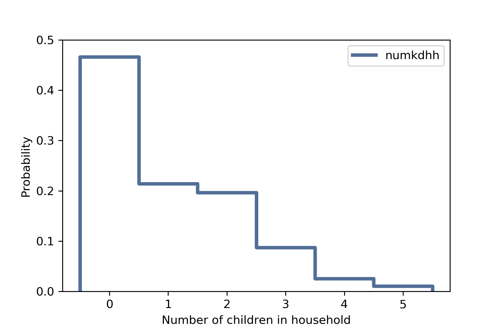
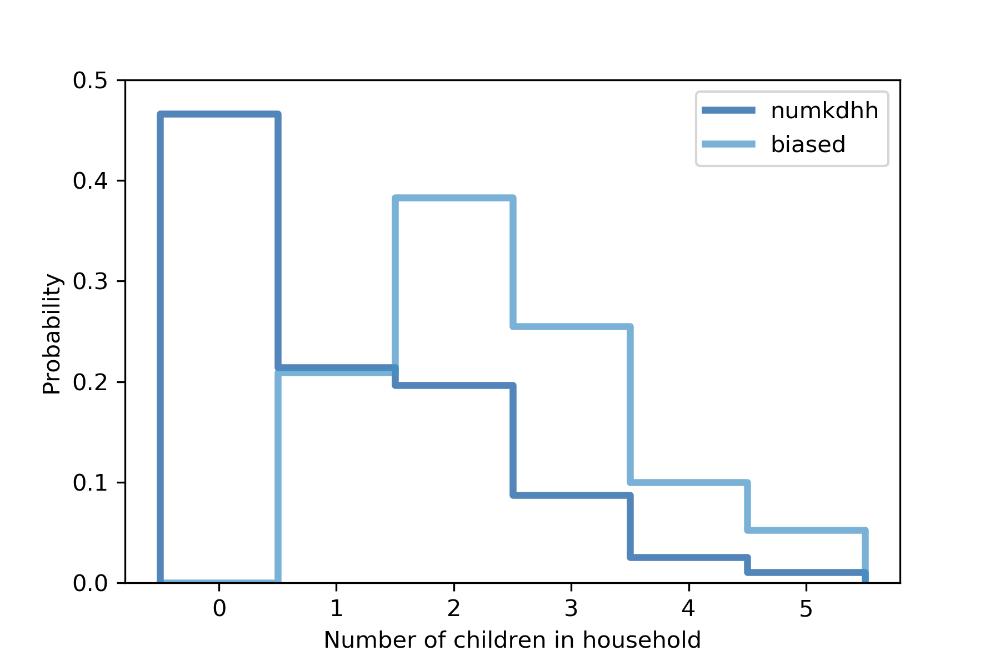

[Think Stats Chapter 3 Exercise 1](http://greenteapress.com/thinkstats2/html/thinkstats2004.html#toc31) (actual vs. biased)
 
# As a starting place, you can use chap03ex.ipynb.

## Part a) Use the NSFG respondent variable `NUMKDHH` to construct the actual distribution for the number of children under 18 in the household. 

Get the libs we are going to want
```python
from __future__ import print_function, division
import numpy as np
import nsfg
import first
import thinkstats2
import thinkplot
%matplotlib inline
```
We want to get `numkdhh` from the NSFG _respondent_ data, which is the number of kids (under 18 residents) in a household.
REad the document from respondents. 
```python
data3 = nsfg.ReadFemResp()
```
Make sure we can get the numkdhh varible
```python
data3['numkdhh'].head()
```
Make the probability mass function for the variable using the author's thinkstats2 module as a Pmf object so we can use their plotting module later.
```python
numkdhh_pmf = thinkstats2.Pmf(data3.numkdhh, label='numkdhh')
```
Plot the distribution using the author's thinkplot module using our Pmf object.
```python
thinkplot.Pmf(numkdhh_pmf)
thinkplot.Config(xlabel='Number of children in household', ylabel='Probability', ylim = [0,.5])
```
Image:


Looks like the mode is 0 kids by a ~20% margin over the next clump at ~47%. Then, the next clump is having 1 or 2 kids. The average is probably around 1 kid based on what we're seeing.

## Part b) Now compute the biased distribution we would see if we surveyed the childrenand asked them how many children under 18 (including themselves) are in their household. Make a plot where we have 2 colors of bars using our 2 Pmf objects.
Define the weighted (biased) function to give us the biased data.
We multiply the probability of each size by the number of kids to 'bias' the sampling such that families with more kids literally have more kids reporting their family's higher family size.
Assign the biased variable name.
```python
def BiasPmf(pmf, label):
    new_pmf = pmf.Copy(label=label)
    for x, p in pmf.Items():
        new_pmf.Mult(x, x)
    new_pmf.Normalize()
    return new_pmf

biased_pmf = BiasPmf(numkdhh_pmf, label='biased')
```

```python
thinkplot.PrePlot(2)
thinkplot.Pmfs([numkdhh_pmf, biased_pmf])
thinkplot.Config(xlabel='Number of children in household', ylabel='Probability', ylim = [0,0.5])
```
Image:


Because np.mean() doesn't work while using the thinkstats2 Pmf objects, we look up and use the .Mean() method.
```python
numkdhh_pmf.Mean(), biased_pmf.Mean()
```
We can observe from the plot and note the mean of numkdhh_pmf = 1.02 while the mean of the biased sample is 2.40. We can clearly see how having kids in larger families all report their larger size biases the mean toward 2 instead of 1 kid households. 
